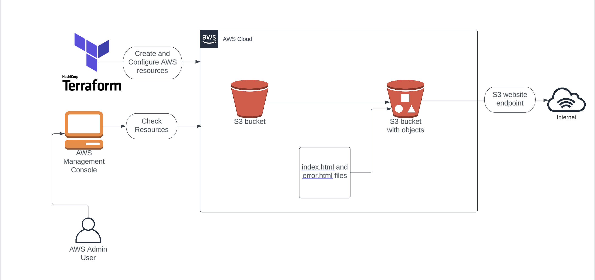

# Host-a-S3-Static-Website-With-Terraform

Task Details
1)Sign in to AWS Management Console

2)Setup Visual Studio Code

3)Create a variables file

4)Create an S3 Bucket and its components in main.tf file

5)Confirm the installation of Terraform by checking the version

6)Apply terraform configuration

7)Check the resources in AWS Console
